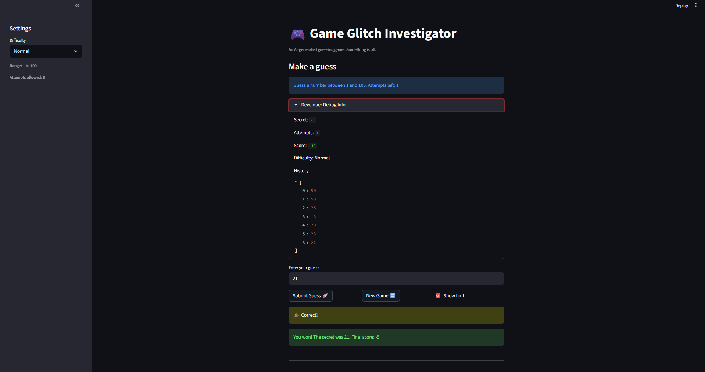
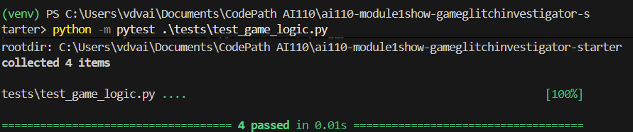

# 🎮 Game Glitch Investigator: The Impossible Guesser

## 🚨 The Situation

You asked an AI to build a simple "Number Guessing Game" using Streamlit.
It wrote the code, ran away, and now the game is unplayable. 

- You can't win.
- The hints lie to you.
- The secret number seems to have commitment issues.

## 🛠️ Setup

1. Install dependencies: `pip install -r requirements.txt`
2. Run the broken app: `python -m streamlit run app.py`

## 🕵️‍♂️ Your Mission

1. **Play the game.** Open the "Developer Debug Info" tab in the app to see the secret number. Try to win.
2. **Find the State Bug.** Why does the secret number change every time you click "Submit"? Ask ChatGPT: *"How do I keep a variable from resetting in Streamlit when I click a button?"*
3. **Fix the Logic.** The hints ("Higher/Lower") are wrong. Fix them.
4. **Refactor & Test.** - Move the logic into `logic_utils.py`.
   - Run `pytest` in your terminal.
   - Keep fixing until all tests pass!

## 📝 Document Your Experience

- [x] **Describe the game's purpose.**  
  This is a number guessing game built with Streamlit where players try to guess a secret number within a range determined by difficulty level (Easy: 1-20, Normal: 1-100, Hard: 1-500). The game provides hints ("Higher" or "Lower"), tracks attempts, awards points based on performance, and includes features like difficulty selection, game history, and a developer debug panel.

- [x] **Detail which bugs you found.**  
  Lack of Streamlit session state caused the secret number, attempts, score, status, and history to reset on every interaction. Hints were incorrect on even-numbered attempts because the secret was cast to string, causing wrong comparisons (e.g., "9" > "10"). Attempt counter started at 1 instead of 0, wasting the first guess. Easy difficulty had fewer attempts (6) than Normal (8), making it harder instead of easier. Hard difficulty had a smaller range (1-50) than Normal (1-100). Info text was hardcoded to "1 and 100" regardless of difficulty. "New Game" button used a hardcoded range (1-100) and didn't reset game status or history. Changing difficulty didn't reset the game state. The check_guess function was defined locally in app.py instead of being refactored to logic_utils.py.

- [x] **Explain what fixes you applied.**  
  Implemented Streamlit session state (`st.session_state`) to persist secret number, attempts, score, status, and history across reruns. Replaced local check_guess definition with an import from logic_utils.py. Fixed string comparison by casting both guess and secret to integers, eliminating wrong hints on even attempts. Corrected attempt initialization to 0, fixed difficulty ranges (Hard now 1-500), and adjusted attempt limits (Easy: 10 attempts, Normal: 8, Hard: 5). Made info text dynamic based on selected difficulty. Updated "New Game" to properly reset all state variables using the correct range. Added logic to reset game when difficulty changes. Refactored shared functions to `logic_utils.py` and added comprehensive pytest tests to verify logic correctness, including edge cases for negative numbers, decimals, and whitespace inputs. Enhanced `parse_guess` to strip whitespace, reject decimals, and require positive integers for better input validation.

## 📸 Demo

- [ ] 
- [ ] 

## 🚀 Stretch Features

- [x] [Completed Challenge 1: Advanced Edge-Case Testing - Added tests for negative numbers, decimals, and whitespace inputs; improved parse_guess validation]
- [ ] [If you choose to complete Challenge 4, insert a screenshot of your Enhanced Game UI here]
